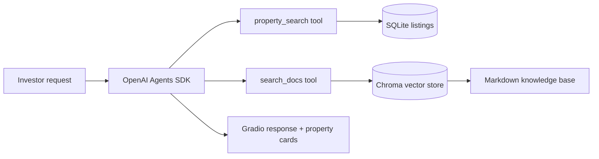

# Apex Property Advisor — Agentic RAG Prototype

An early applied-AI prototype for helping foreign investors explore UAE off-plan property options and retrieve supporting information about ownership, financing, fees, and visas.

The project combines deterministic data access with an LLM agent instead of asking the model to invent property facts.

## Architecture



## Engineering highlights

- **Tool-based grounding.** The agent calls a parameterised SQLite search for price, bedroom, and location filters instead of generating listing details from memory.
- **Retrieval-augmented answers.** Legal, visa, tax, financing, and ownership questions are routed through a Chroma retriever built from the local Markdown knowledge base.
- **Input and startup validation.** The application checks the API key, database file, table, and required schema before launching.
- **Observable agent runs.** OpenAI Agents SDK tracing wraps conversations for debugging and inspection.
- **Result presentation.** A Gradio interface displays up to three property recommendations and caches remote listing images locally.

## Run locally

Requires Python 3.12 and an OpenAI API key. Copy `.env.example` to `.env`, then replace the placeholder key.

```bash
uv sync
uv run application.py
```

## Status and limitations

This is a portfolio prototype, not a production brokerage product. The repository includes local sample databases and generated vector-store artifacts, has no automated test suite, and does not guarantee that regulatory material is current. Recommendations require independent verification and do not constitute financial, legal, immigration, or property advice.

Development continued in [uae-property-ai-advisor](https://github.com/ziyadal/uae-property-ai-advisor), which adds structured multi-turn constraints, deterministic ranking, explicit no-match behavior, failure-mode tests, and a more complete recommendation interface.

